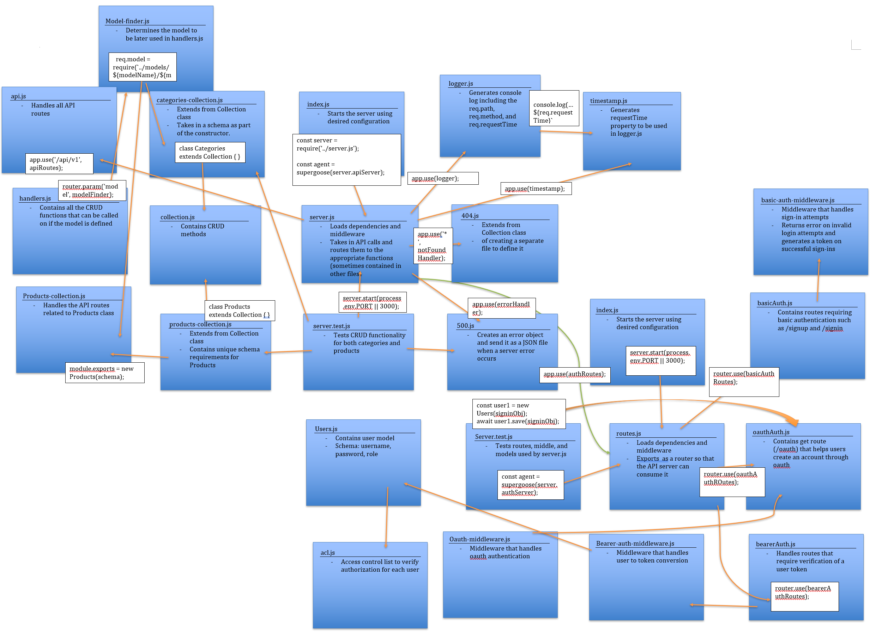

# Module 3 Final Project: API Server

## Implement a fully functional, authenticated and authorized API Server using the latest coding techniques

### Author: Earl Jay Caoile

### Links and Resources

- [submission PR](https://github.com/js-401n15-eoc/lab-15/pull/1)
- [GitHub Actions](https://github.com/js-401n15-eoc/lab-15/actions)

#### Documentation

- [MongoDB docs (MongoDB CRUD Operations)](https://docs.mongodb.com/manual/crud/)
- [jsonwebtoken](https://www.npmjs.com/package/jsonwebtoken)
- [bcrypt] (https://github.com/kelektiv/node.bcrypt.js#readme)

### Setup

#### Configuring MongoDB

- create an .env file on the top level of this repo defining the following variables:

```
MONGODB_URI=mongodb://localhost:27017/lab-15
PORT=3000
CLIENT_ID=<insert client id here from github>
CLIENT_SECRET=<insert client secret here from github>
REDIRECT_URI=http://localhost:3000/oauth
```

- start your database with the path of the DB along with the folder location for your DB files (`mongod --dbpath=/Users/path/to/data/db`: i.e. `"C:\Program Files\MongoDB\Server\4.2\bin\mongod.exe" --dbpath="D:\db"`)

#### Tests

- Testing command: `npm test` from root directory

#### UML


